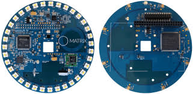

# 1. Sound source localization using Beamforming Microphone Arrays

## Introduction

The first microphone arrays were used as early as the 1970s. It was called the “Acoustic Telescope” and opened up research in the area of Acoustic Sound Localization. Sound source Localisation has many applications such as  ground  military surveillance, reconnaissance and intrusion detection.
MEMS microphones have an omnidirectional pickup response, which means that they respond equally to sounds coming from any direction. However, multiple microphones can be configured in an array to form a directional response, or a beam pattern. A beamforming microphone array can be designed to be more sensitive to sound coming from one or more specific directions than sound coming from other direction. The greater the change in the output level of the microphone array with the change in the direction of sound, the greater is the directionality of  the microphone [1].

## Project Implementation

For the implementation in our project, we propose to use the Matrix creator, a powerful accessory for the Raspberry Pi by Matric Labs. The Matrix creator integrates a number of sensors: Temperature sensor, Humidity sensor, Ultraviolet sensor, Pressure sensor, 3D Accelerometer, 3D Gyroscope,3D Magnetometer along with an 8 MEMS Microphone array which we would use for Sound Localization. The Matrix Creator comes with its own MATRIX OS for Raspberry Pi, which provides some easy to use APIs in JavaScript for interacting with all the various sensors on board.

## Literature Review

Many variations of algorithms using a microphone array for source localization in the near field as well as direction-of arrival (DOA) estimation in the far field have been proposed [2]. Many of these techniques involve a relative time-delay estimation step that is followed by a least squares fit to the source’s direction of arrival, or in the near-field case, a least squares fit to the source location [3,4]. [5] demonstrates the localization of sound via the cross bearing from several widely separated arrays. In the case of multiple sources, an alternating projection procedure has been applied to determine the Maximum Likelihood  estimate of the Direction of Arrivals from the observed data.

* [1] Jerad Lewis, “Application note for AN-1140 Beamforming Microphone Arrays”
* [2] M. S. Brandstein and D. Ward, Microphone Arrays: Techniques and Applications, Springer-Verlag, Berlin, Germany, September 2001.
* [3] J. O. Smith and J. S. Abel, “Closed-form least-squares source location estimation from range-difference measurements,” IEEE Trans.   Acoustics, Speech, and Signal Processing, vol. 35, no. 12, pp. 1661–1669, 1987.
* [4] H. C. Schau and A. Z. Robinson, “Passive source localization employing intersecting spherical surfaces from time-ofarrival           differences,” IEEE Trans. Acoustics, Speech, and Signal Processing, vol. 35, no. 8, pp. 1223–1225, 1987
* [5] Joe C. Chen, Kung Yao, Ralph E. Hudson, “Acoustic Source Localization and Beamforming: Theory and Practice”,EURASIP Journal on       Applied Signal Processing 2003:4, 359–370
