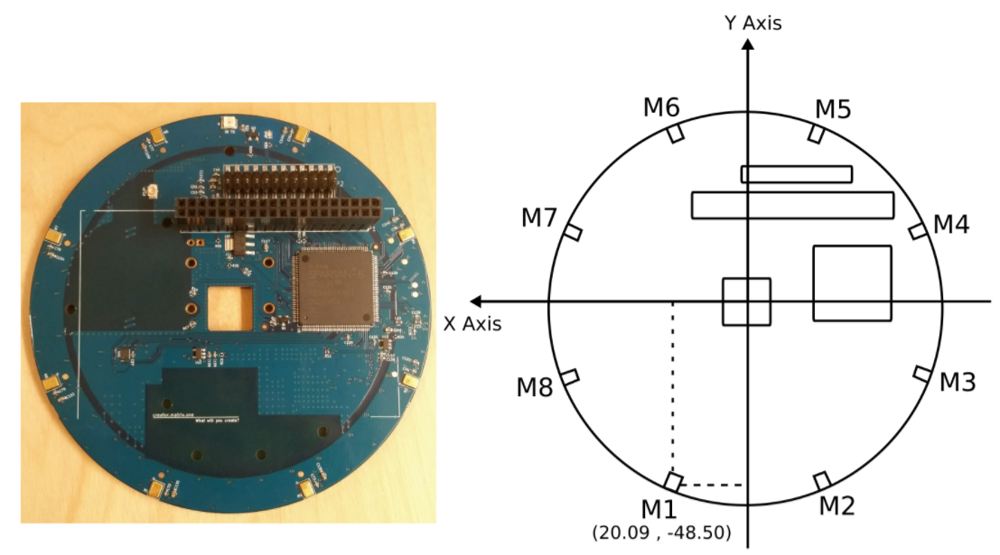
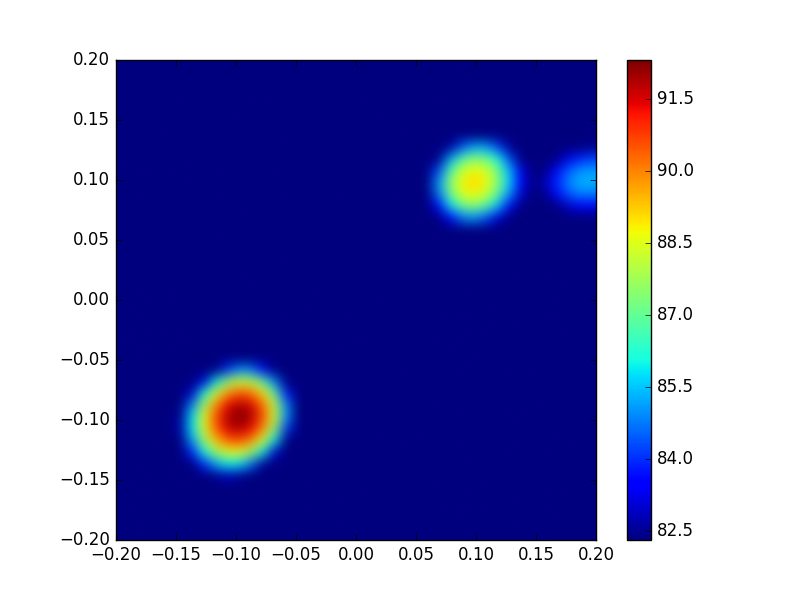
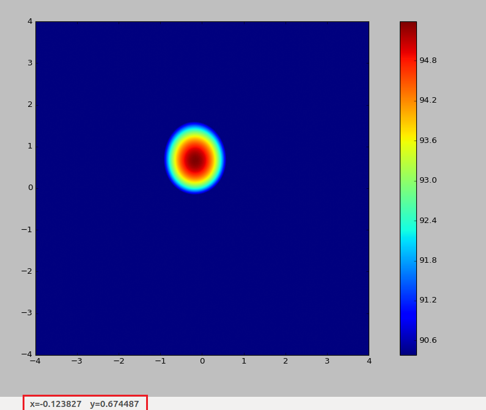
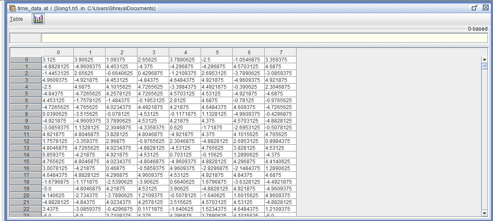

# 1. Sound source localization using Beamforming Microphone Arrays

## Introduction

* The first microphone arrays were used as early as the 1970s. It was called the “Acoustic Telescope” and opened up research in the area of Acoustic Sound Localization. Sound source localization has many applications such as  ground  military surveillance, reconnaissance and intrusion detection.

* MEMS microphones have an omnidirectional pickup response, which means that they respond equally to sounds coming from any direction. However, multiple microphones can be configured in an array to form a directional response, or a beam pattern.

* A beamforming microphone array can be designed to be more sensitive to sound coming from one or more specific directions than sound coming from other direction. The greater the change in the output level of the microphone array with the change in the direction of sound, the greater is the directionality of  the microphone [1].

## Project Implementation

For the implementation in our project, we propose to use the Matrix creator, a powerful accessory for the Raspberry Pi by Matric Labs. The Matrix creator integrates a number of sensors: Temperature sensor, Humidity sensor, Ultraviolet sensor, Pressure sensor, 3D Accelerometer, 3D Gyroscope,3D Magnetometer along with an 8 MEMS Microphone array which we would use for Sound Localization. The Matrix Creator comes with its own MATRIX OS for Raspberry Pi, which provides some easy to use APIs in JavaScript for interacting with all the various sensors on board.

# Microphone Array on Matrix Creator

Source: [https://matrix-io.github.io/matrix-documentation/](https://matrix-io.github.io/matrix-documentation/)

HAL is the lowest-level abstraction for the MATRIX Creator. It provides C++ drivers for sensors and the FPGA and microcontrollers on the MATRIX device.

The matrix creator provides a circular array of 8 omnidirectional microphones.
(Data sheet: [MP34DB02 - MEMS audio sensor omnidirectional digital microphone](http://www.st.com/content/ccc/resource/technical/document/datasheet/57/af/88/31/7b/59/4f/77/DM00111225.pdf/files/DM00111225.pdf/jcr:content/translations/en.DM00111225.pdf))

* The Matrix Hardware abstraction Layer (HAL) provides APIs to obtain samples from all channels (mics) collected by the FPGA and write down the audio samples  as Pulse code modulated values into .raw files.
* The Matrix also provides an 8th channel which is the beamformed channel. -
* The beamformed channel is the resultant value of the sound samples captured by the 8 mics calculated using a simple delay and add algorithm. By default, the Matrix samples at 16000 samples/sec.

## Installing matrix creator microphone array software packages
   * `curl https://apt.matrix.one/doc/apt-key.gpg | sudo apt-key add -`
   * `echo "deb https://apt.matrix.one/raspbian $(lsb_release -sc) main" | sudo tee /etc/apt/sources.list.d/matrixlabs.list`
   * `sudo apt-get update`
   * `sudo apt-get upgrade`
   * `sudo apt-get install cmake g++ git libfftw3-dev wiringpi matrixio-creator-init libgflags-dev`
   * `git clone --recursive https://github.com/matrix-io/matrix-creator-hal.git`
   * `cd matrix-creator-hal && mkdir build && cd build`
   * `cmake ..`
   * `sudo make && sudo make install`
Refer to [this repository](https://github.com/matrix-io/matrix-creator-hal) for sample programs to use the Matrix.
# Beamforming Using Acoular packages

  * Acoular is a framework for acoustic beamforming that is written in the Python programming language. It is aimed at applications in acoustic testing.
  * Multichannel data recorded by a microphone array can be processed and analyzed in order to generate mappings of sound source distributions.
  * The maps (acoustic photographs) can then be used to locate sources of interest and to characterize them using their spectra. (Reference: [http://acoular.org/](http://acoular.org/))

The Acoular package takes in the multi-channel audio samples in Hierarchical Data format (.hd5). The .raw data provided by the Matrix is converted into .h5 format and input to the beamforming functions of acoular. The following results were obtained.

## Installing Acoular packages on a Linux Machine

  * Follow the installation instructions given in this [link](http://www.acoular.org/install/index.html) under the heading *Option 1*. Other *options* will require us to download the dependencies on our own. Type the following on the command line/terminal after installing Anaconda.
    `conda install -c acoular acoular`

# Beamforming results on simulated data:

The acoular library provides some utilities to simulate sources of sound in the absence of an actual experimental setup.  It generates the sound pressure time histories for all channels of the microphone array in a hierarchical data file (HDF5) format if the location of the sound sources w.r.t the centre of the microphone array is given.

The sources location: (0.1,0.1) (-0.1,-0.1) (0.1,-0.1)

# Beamforming results on audio samples collected from Matrix:

The beamforming functions were then applied to the sound samples collected from Matrix after converting the .raw files into .h5 files .

# Audio Samples from Matrix in HD5 format

The figure above shows the mics (along the columns) and their normalized intensities (along the rows) . This is input to the beamforming functions.

## Literature Review

Many variations of algorithms using a microphone array for source localization in the near field as well as direction-of arrival (DOA) estimation in the far field have been proposed [2]. Many of these techniques involve a relative time-delay estimation step that is followed by a least squares fit to the source’s direction of arrival, or in the near-field case, a least squares fit to the source location [3,4]. [5] demonstrates the localization of sound via the cross bearing from several widely separated arrays. In the case of multiple sources, an alternating projection procedure has been applied to determine the Maximum Likelihood  estimate of the Direction of Arrivals from the observed data.

* [1] Jerad Lewis, “Application note for AN-1140 Beamforming Microphone Arrays”
* [2] M. S. Brandstein and D. Ward, Microphone Arrays: Techniques and Applications, Springer-Verlag, Berlin, Germany, September 2001.
* [3] J. O. Smith and J. S. Abel, “Closed-form least-squares source location estimation from range-difference measurements,” IEEE Trans.   Acoustics, Speech, and Signal Processing, vol. 35, no. 12, pp. 1661–1669, 1987.
* [4] H. C. Schau and A. Z. Robinson, “Passive source localization employing intersecting spherical surfaces from time-ofarrival           differences,” IEEE Trans. Acoustics, Speech, and Signal Processing, vol. 35, no. 8, pp. 1223–1225, 1987
* [5] Joe C. Chen, Kung Yao, Ralph E. Hudson, “Acoustic Source Localization and Beamforming: Theory and Practice”,EURASIP Journal on       Applied Signal Processing 2003:4, 359–370
