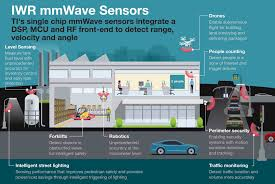

# 2. RF Imaging using mmWave Sensors

## Introduction
Electromagnetic radiation in the range of wavelengths from 1 cm to 1 mm is characterized as millimeter-wave (MMW) radiation. One of the modem trends in radar technology development is moving of operating frequencies to millimeter wave part of spectrum. [1] notes the advantages of  such high frequencies: such as compact system size, high spatial and better target resolution. There are two most common forms of mm-wave imaging: Passive MM-Wave Imaging, Active Radar Imaging. Active scanners direct millimeter wave energy at the subject and then interpret the reflected energy. Passive systems create images using only ambient radiation and radiation emitted from the human body or objects.

## Implementation

We propose to use the mmWave by Texas Instruments, IWR1642 for RF Imaging. The IWR1642 device is as a highly integrated 76–81-GHz radar-on-chip solution for short-range radars. The device comprises the entire millimeter wave (mmWave) radio-frequency (RF) and analog baseband signal chain for two transmitters (TX) and four receivers (RX), as well as two customer-programmable processor cores in the form of a C674x digital signal processor (DSP) and an ARM® Cortex®-R4F microcontroller (MCU). (Reference: White paper- IWR1642 mmWave sensor: 76–81-GHz radar-on-chip for short-range radar applications)

## Literature Survey
The current radar hardware and computational methods are developed for mainstream radar applications, such as air and terrestrial traffic control, marine radar remote sensing, outer space surveillance [3].  In recent years, there has been a certain amount of research interest in the design of next-generation radar systems for applications such as gesture recognition (e.g., implemented on handhelds, laptops or televisions), surveillance and vehicular situational awareness. [3]  presents Soli, a new, robust, high-resolution, low-power, miniature gesture sensing technology for human-computer interaction based on millimeter-wave radar. [4] illustrates the use of mmWave sensors  to detect non metallic objects like ceramic knifes as well as metallic objects hidden under clothes. [5] demonstrates a  passive millimeter-wave imaging concept based on a folded Schmidt camera which has been developed and applied to poor weather navigation and security .

* [1] D. Komeev, L. Bogdanov, A. Nalivkin, S. Berezin, “3D Imaging System based on FMCW Millimeter Wave Radar ”,
* [2] Graham M Brooker, “Millimetre Wave Radar for Tracking and Imaging Applications”, 1st International Conference on Sensing             Technology November 21-23, 2005 Palmerston North, New Zealand
* [3] Jaime Lien∗ , Nicholas Gillian, M. Emre Karagozler, Patrick Amihood, Carsten Schwesig, Erik Olson, Hakim Raja, Ivan Poupyrev,         “Soli: Ubiquitous Gesture Sensing with Millimeter Wave Radar”
* [4] S. Stanko et. al. “Active and Passive mm-Wave imaging for Concealed Weapon Detection and Surveillance”
* [5] Ingrid Ullmann1, Julian Adametz1, Daniel Oppelt1, Martin Vossiek1, “Millimeter Wave Radar Imaging for Non-Destructive Detection of Material Defects”, AMA Conferences 2017
