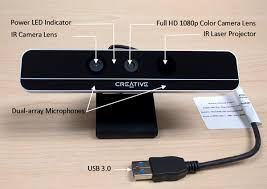

## Intel RealSense SR300

1. The camera has an indoor range of 0.5-3.5 m while an outdoor range of 10m.
2. The SR300 includes stereo cameras as well as the RGB camera.
3. The color camera provides the images for humans and the 2 depth cameras provide the data for    algorithmic consumption.
4. The SR300 tracks the camera movement in 3D space with 6 DOF (degrees of freedom).3 Degrees from the Front/Back/Up/Down/Left/Right and 3 degrees from Yaw/Pitch/Roll movements.
5. The SR300 camera is compatible with Jetson board and comes with RealSense SDK which provides easy programming for it.

# SR300 Specifications

