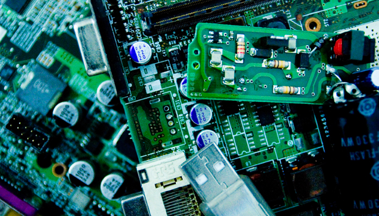

## Hardware Resources

1. [Nvidia Jetson Tx2 development board](Jetson.md)
2. Matrix Respeakers microphone array - 2 Nos
3. Intel R200 realSense camera
4. FLiR Dev Kit (thermal Camera kit)
5. Ti mm wave AWR1642 Sensor EVM board.
6. AmazonBasics 7 Port USB 3.0 Hub with 12V/3A Power Adapter.
7. Rack for Sensor Alignment
8. Raspberry pi 3 . - 2 Nos

## Software Resources

1. TensorFLow [Installing TensorFlow on Jetson TX2](https://github.com/jetsonhacks/installTensorFlowTX2)
