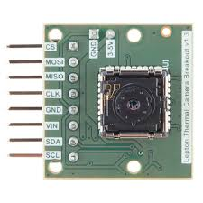

# 4.  Thermal imaging using thermal sensors

## Introduction

Thermal imaging is the technique of using the heat given off by an object to produce an image of it or locate it. It has several applications in fire fighting, medical, security and several other industries. The advantage of using thermal cameras is that they can passively see all objects, regardless of ambient light. They provide a non-invasive and non-destructive means of identifying air leakages material irregularities etc. and hence are used for Nondestructive testing, Chemical imaging, Night Vision and UAV surveillance.

## Implementation

FLIR's Lepton is a complete long-wave infrared (LWIR) camera module designed to interface easily into native mobile-device interfaces and other consumer electronics. It captures infrared radiation input in its nominal response wavelength band (from 8 to 14 microns) and outputs a uniform thermal image.

## Literature Review
Thermal imaging camera technology has provided relevant developments for security systems, being used in surveillance activities such as law-enforcement, home intrusion detection and power line maintenance. [1] illustrates the development of a low cost thermal imaging camera s an alternative to the long wave infrared sensor. [2]  presents the development of a system using a thermal camera. [3] presents the evaluation of soil property based on thermal imaging.

[1] Daniel Garigali Pestana, Fábio Mendonça and F. Morgado-Dias,”A low cost FPGA based thermal imaging camera for fault detection in PV panels”.
[2] Ilona Costea, Catalin Dumitrescu, Marius Minea and Andrei Banica, “Analysis of facial expressions using thermal imaging”, 2016 39th International Spring Seminar on Electronics Technology (ISSE)
[3]  C. Nakayama et. al. Two-dimensional evaluation of soil property based on thermal imaging, SICE Annual Conference 2008
