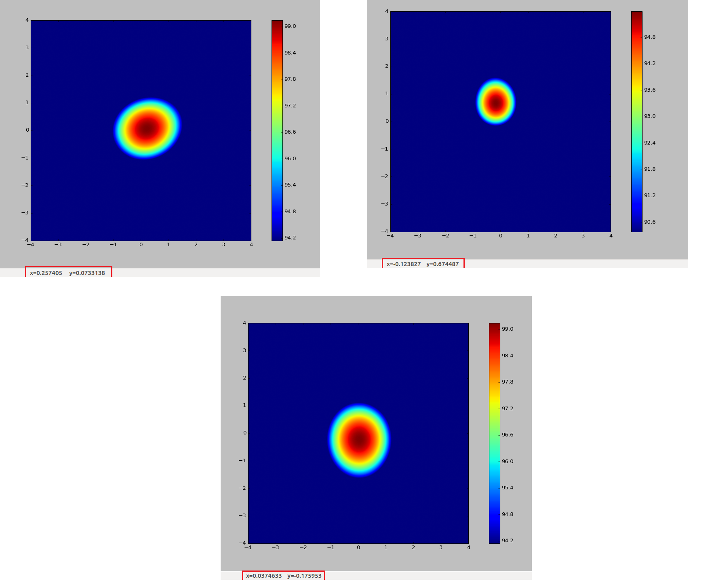
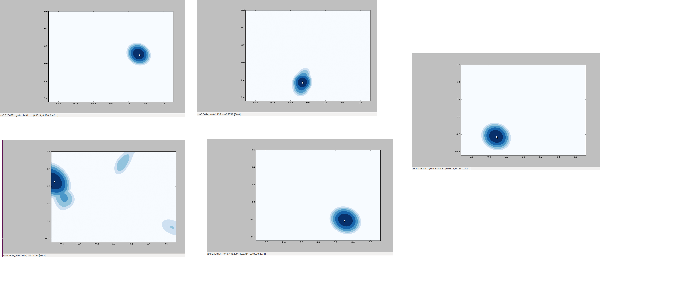

# Sensor Outputs

## Device setup

   * The Intel RealSense SR300 camera is placed above the Matrix creator with the displacement of *8CM* as shown in the image below:

   

   * The Matrix Microphone array is placed such that the mic geometry is as shown below:

   

## Frame Size Calculations

1. Field of view: Intel Realsense
  * Vertical Field of View: 55 Deg
  * Horizontal field of View: 71.5 Deg
2. Field of view: Matrix
  * Azimuthal plane range: -pi/2 to pi/2
  * Polar plane range: -pi/2 to pi/2
3. Frame Size: 1.43mx1.04mx1m (Limited by IR camera) (Calculated using the field of view of the Intel Realsense Camera at Depth 1m). Depth is chosen as 1m as the Depth camera has a maximum range as 1.2m.
4. Displacement between the center of the IR camera and Matrix: 8cm

## Matrix Results

  * Source Location 1:

  

  * Source Location 2:

  

  * Source Location 3:

  

## Ground Truth
### Ground Truth samples

### Ground Truth details

2 Samples at different x,y and depth were take for each quadrant. For each position only one sample was taken since the error values remained very similar to the previous sample.

|Depth(m)| y co-ordinate(m)|Observed y co-ordinate (m)| Error along x direction (m)|Angular error in deg| x co-ordinate(m)| Observed x co-ordinate(m)| Error along y direction(m)| Angular error in deg|
|--------|----------------|-------------------------|--------------------------|-------------------|--------------------|-------------------------|---------------------------|--------------------|
|0.8|-0.2|-0.17|0.03|1.07|0|0.037|0.037|1.32|
|0.5|0.8|0.674|0.126|2.4|-0.3|-0.1238|0.1762|3.361|
|0.6|0.25|0.27|0.02|0.9|-0.64|-0.68|0.04|1.9|
|1|0.05|0.073|0.023|0.658|0.20|0.257|0.057|1.63|
|0.25|0.16|0.11|0.05|5.7|0.36|0.32|0.04|4.57|
|0.75|-0.13|-0.21|0.07|2.67|0.23|-0.06|0.29|10.9|

* Angular Error = Tan-1((error/2)/depth)
* Average Ground Truth = 2.233(along y) , 3.94(along x)

## Realsense IR Images

  * Source Location 1: (-0.56,0.50,0.75)m

  

  * Source Location 2: (0.58,0.58,0.6)m

  

  * Source Location 3: (0.27,-0.35,0.9)m

  

## Realsense Depth Images

  * Source Location 1: (-0.56,0.50,0.75)m

  

  * Source Location 2: (0.58,0.58,0.6)m

  

  * Source Location 3: (0.27,-0.35,0.9)m

  
